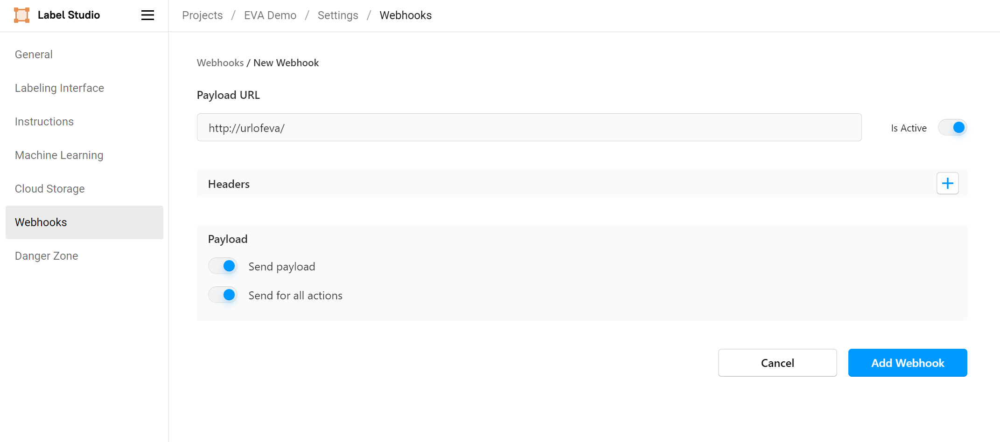

# eva-labeling
## What is EVA Labeling?

The EVA Labeling is a wrapper to enable you to run EVA along side [Label-Studio](!https://labelstud.io/)
It lets you connect to Label Studio server to do the following:

- Cluster similar images to speed up the Labeling Process
- Dynamically pre-annotate data based on model inference results
- Retrain or fine-tune a model based on recently annotated data


## How it works

1. This application helps fetch data from Label Studio server and add it to EVA.
2. Then you use Label Studio ML Backend to run `EVA QL` Statement on you data. (e.g. Clustering, Object detection, Object Tracking)
3. Returns the desired output to Label Studio


## Quickstart

1. Clone this repository
    ```bash
    git clone https://github.com/Aryan-Rajoria/eva-labeling.git
    ```

2. Setup Environment  
    It is highly recommended to use `venv`, `virtualenv` or `conda` python environments. You can use the same environment as Label Studio does. [Read more](https://docs.python.org/3/tutorial/venv.html#creating-virtual-environments) about creating virtual environments via `venv`.
   ```bash
   cd eva-labeling
   
   # Install eva-labeling dependencies
   pip install -r requirements.txt
   ```

3. Start eva-labeling server
    > Note: this will also start the `evadb` server.
    ```bash
    python manage.py runserver
    ```
    
4. Register Webhook to Label Studio server
    > Add webhook to the project, in which you want to use `evadb`
    

5. Start and Register EVA ML Backend to Label Studio.
    > Follow [Label Studio ML documentation](https://github.com/heartexlabs/label-studio-ml-backend)
    > The model can be found in [`eva-ls-ml`](https://github.com/Aryan-Rajoria/eva-ls-ml)
    
    
