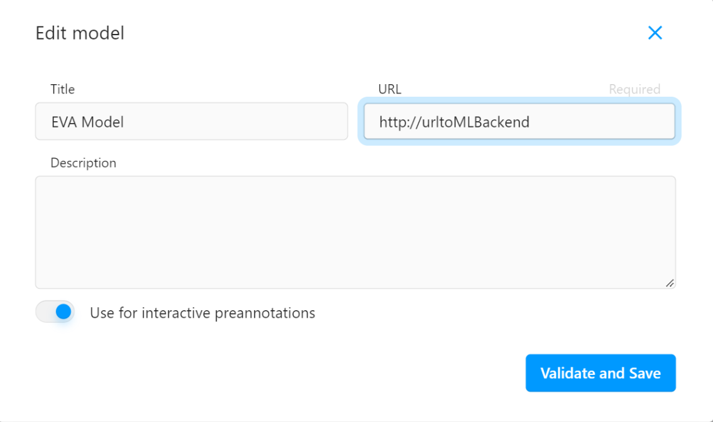
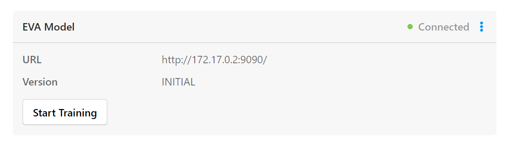
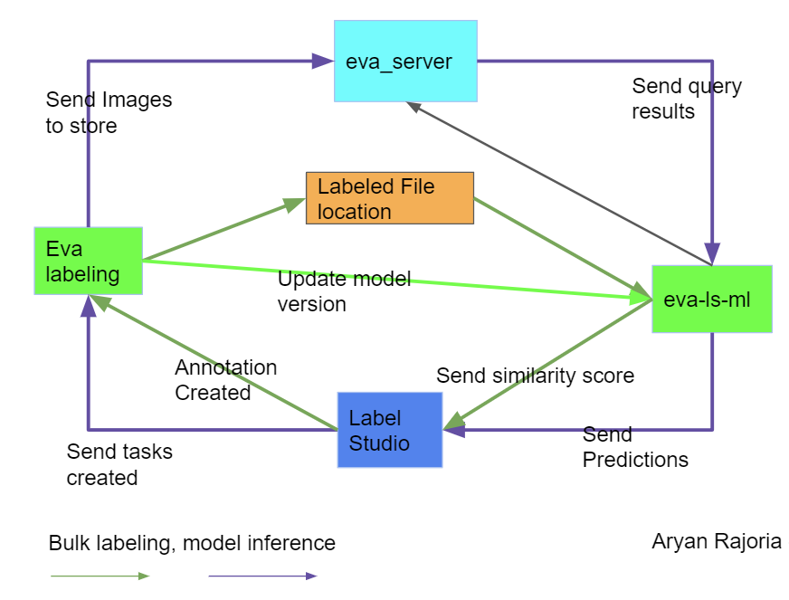

# eva-labeling
## What is EVA Labeling?

EVA Labeling is a wrapper to enable you to run EVA alongside [Label-Studio](!https://labelstud.io/) It lets you connect to Label Studio server to do the following:

- Annotate your dataset more quickly and easily by allowing "bulk labeling" of a set of images.
- Dynamically pre-annotate data based on model inference results.
- Retrain or fine-tune a model based on recently annotated data.

## Demo video

https://user-images.githubusercontent.com/57455619/229378952-b1048139-3d05-4377-a1bb-83a39fc174d6.mp4

## How it works

1. It first fetches <image, label> pairs from Label Studio server and loads them into the EVA database server.
2. It then runs queries over the loaded data within the EVA database server (e.g., Image Classification Query, Object Detection Query)
3. Finally, it sends the query results (i.e., updated labels) back to the Label Studio server.

## Quickstart

> :warning: The Label Studio server should be started with flag **EXPERIMENTAL_FEATURES=1** Otherwise Bulk Propagation will not work!

1. Setup Environment  
    It is highly recommended to use `venv` python environments. You can use the same environment as Label Studio. [Read more](https://docs.python.org/3/tutorial/venv.html#creating-virtual-environments) about creating virtual environments via `venv`.
   ```bash
   # Install Label Studio ML Backend
   pip install label-studio-ml
   # Install dependencies
   pip install -r requirements.txt
   ```

2. Start eva-labeling server
    > Note: this will also start the `evadb` server.
    ```bash
    label-studio-ml start ./evaml -eu <eva-server-url> -ep  <eva-server-port> -k <apikey> -ls <label-studio-url>
    ```

3. Add Image Clustering Interface
    ```html
    <View>
    <Image name="image" value="$image"/>
    <RectangleLabels name="label" toName="image">
      
    </RectangleLabels>
    <TextArea name="cluster" toName="image"
              rows="1" editable="true" />
    </View>
    ```

4. Start and Register EVA ML Backend to Label Studio.
    > Following [Label Studio ML documentation](https://github.com/heartexlabs/label-studio-ml-backend)  
    
    


<!-- EVA ML 
 -->

## Adding Custom Models to EVA

1. Register your Feature Extractor model into EVA.
    > Refer [EVA docs](https://evadb.readthedocs.io/en/stable/source/reference/udf.html) for more information.
    > [Here](https://evadb.readthedocs.io/en/stable/source/tutorials/04-custom-model.html) is an example of adding a custom model.

2. you may add your queries inside `./evaml/cluster_image.py`, 
    > Refer [Label Studio ML Backend](https://github.com/heartexlabs/label-studio-ml-backend) for more information.
